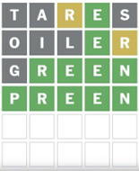

# Wordle Solver

A Python-based Wordle solver that utilizes entropy-based guesses and optimizes the guessing process.

## Features
- Solves Wordle puzzles using entropy-based strategies.
- Handles user input and generates the next best guesses.
- Optimizes guesses by considering all potential patterns and results.

## Installation

Clone the repository:

```bash
git clone https://github.com/your-username/wordle-solver.git
````

Install the required dependencies:

```bash
pip install -r requirements.txt
```

## How It Works

This solver uses an entropy-based strategy to solve Wordle puzzles. The first guess is always "tares", which has been selected based on its high entropy (information gain). The solver then adjusts its guesses based on the feedback received from the user, and uses that feedback to suggest the next best guesses. The game continues until the word is correctly guessed.

## Example Usage

1. **Initial Guess**: "tares"
2. **Pattern**: Enter the pattern (e.g., `00120`) after each guess.
3. **Best Next Guesses**: The solver suggests the five best next guesses based on the feedback.
4. **Repeat**: Continue the guessing process until the word is guessed correctly.

```python
# Example interaction:
Your guess: tares
Pattern you got as a result of the guess: 00120
The five best next guesses are: oiler, riled, older, eider, filer

Your guess: oiler
Pattern you got as a result of the guess: 00021
The five best next guesses are: green, preen, creep, creed, greed

Your guess: green
Pattern you got as a result of the guess: 02222
The five best next guesses are: preen

Your guess: preen
Pattern you got as a result of the guess: 22222
Guessed in 3 attempts
```

## Screenshot



## Conclusion

This Wordle solver provides an efficient way to solve Wordle puzzles using a data-driven approach. The entropy-based strategy optimizes guesses, reducing the number of attempts needed to guess the word correctly.
